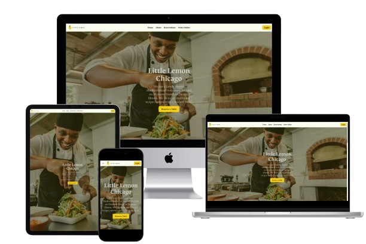

# Little Lemon Restaurant Website

Website for a chicago based mediterranean restaurant "Little Lemon". This is just a demo frontend project.
<br>

<p align="center">


<a href="https://little-lemon-restaurant-beta.vercel.app/">
  
</a>
  <h1 align="center">
    <a href="https://little-lemon-restaurant-beta.vercel.app/">« Live Demo »</a>
  </h1>
</p>
<p align="center"></p>

## Get Started
### Clone the repository and Install the dependencies
```
git clone https://github.com/vaidik219/little-lemon-restaurant.git
cd little-lemon-restaurant
npm install
```
### Run the app
```
npm start
```